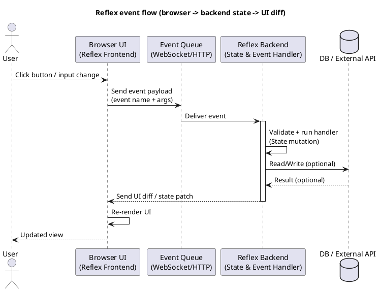
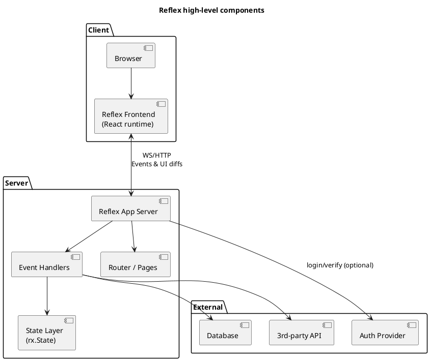
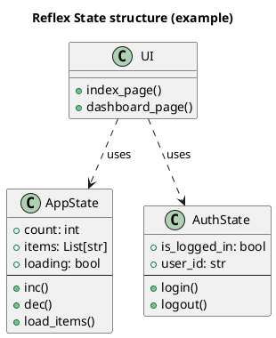
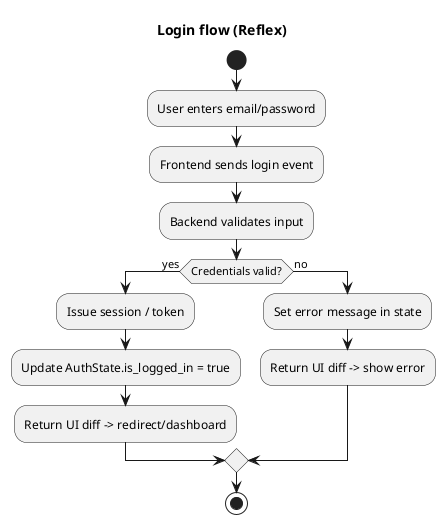
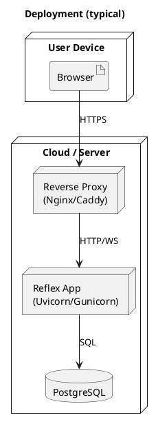

我先快速整理：你要的是「用 PlantUML 表達 Python Reflex 專案」的圖。我會直接給你一組可貼上就能產圖的 PlantUML 範本（包含常用的幾種圖），你可以照你的專案改名與補細節。

下面給你一套「Python Reflex（reflex.dev）常見架構」的 PlantUML 圖範本，你可以直接複製貼到 PlantUML（或你自己的文件系統）就能出圖，再把元件/流程改成你的專案名稱即可。

---

## 1) Sequence Diagram：瀏覽器觸發事件 → Reflex 事件處理 → UI 更新

---

## 2) Component Diagram：Reflex 系統元件切分（前端/後端/外部）

---

## 3) Class Diagram：State 與事件（event handlers）骨架

---

## 4) Activity Diagram：登入流程（含成功/失敗分支）

---

## 5) Deployment Diagram：部署到雲端的常見型態（反向代理 + App）

